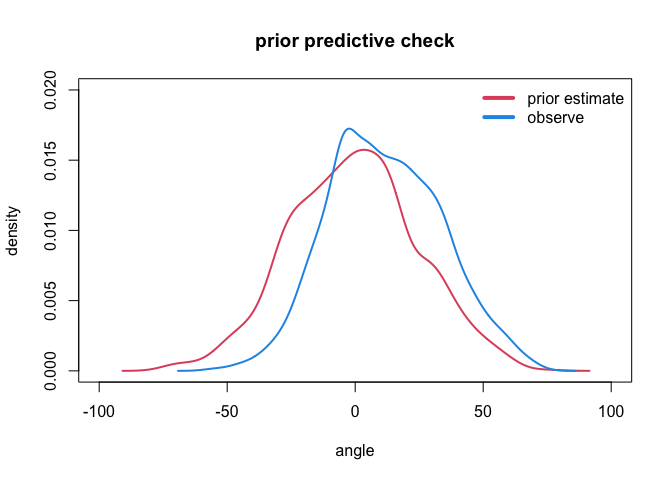

Baseball
================

# Installation

``` r
library(cmdstanr)
library(dplyr)
library(bayesplot)
library(posterior)
library(tidyverse)
library(rethinking)
library(dagitty)
```

``` r
source('util.R')
```

# Data story

The project aims at evaluating the performance of hitters in Major
League Baseball (MLB) through 07 metrics and 73375 observations. In the
data set, each batter and pitcher are assigned unique ID. There are two
systems, A and B, tracking two main metrics of exit velocity (EV) and
launch angle (LA). There are measurement errors and missing data points
from both system

By definition, exit velocity measures the speed of the baseball as it
comes off the bat, immediately after a batter makes contact. Launch
angle represents the vertical angle at which the ball leaves a player’s
bat after being struck. There are 5 hit types which are defined by the
associated launch angle

The ultimate goal of the project is to predict the average exit velocity
for each batter in the following season. The project is written in Stan
and implements a full Bayesian approach

``` r
path = '...'
```

``` r
df <- read.csv(paste0(path,'/data/battedBallData.csv'))
head(df)
```

    ##   batter pitcher     hittype   speed_A   vangle_A   speed_B   vangle_B
    ## 1    393     405 ground_ball 110.98757   4.194081 103.84257   3.164307
    ## 2    366     405 ground_ball  60.09840 -54.652102  28.09220 -28.324082
    ## 3    448     518  line_drive 102.75760  11.751851  97.84600  11.658800
    ## 4    140     518    fly_ball  61.95209  33.488154  59.38974  32.798274
    ## 5    521     518  line_drive 116.69086  22.700762 111.01456  23.164572
    ## 6    401     518 ground_ball 105.98183 -10.497794  78.50893  -7.471214

``` r
sprintf('the percentage of missing value from system A is %s', round(mean(is.na(df$vangle_A)),2))
```

    ## [1] "the percentage of missing value from system A is 0.1"

``` r
sprintf('the percentage of missing value from system B is %s', round(mean(is.na(df$vangle_B)),2))
```

    ## [1] "the percentage of missing value from system B is 0.02"

# Directed Acyclic Graph (DAG)

The DAG bellow graphically pictures the causal connection between
variables. Although the project is towards predictions, the DAG is very
important as it explicitly speaks of the theory behind the models.
Therefore, we are able to revise and improve our model’s predictive
performance. The direct arrow implies a causal relationship between two
variables

In the DAG, P and A stands for pitcher and launch angles. The invisible
contact between batter and pitcher can impact the initial vertical
angle. Depending on the angle, the observer will record the type of
hits, represented by variable H. The speed-of-bat (S) is directly
influenced by the angle. Given the assumption that batters always try to
hit the ball straightforward, the speed and the angle will have inverse
relationship

``` r
dag1 <- dagitty("dag{P->A->S; A->H}")
coordinates(dag1) <- list(x=c(P=0,A=1,H=1,S=2), y=c(P=0,A=0,H=-1,S=0))
drawdag(dag1)
```

<!-- -->

# Models with complete case

## Data

We will build up our models incrementally and start with an ideal case
of that we drop all observations with missing data. As the missing data
accounts for less than 10% of the data set, we expect that the
predictive power of the models will be closely similar

``` r
df_complete <- df[complete.cases(df),]
N <- 3000
```

Due to a computational power limit, the training data set will contains
only N observations. However, every models that are built up in the
following part perfectly work with the entire data set

``` r
df_train1 <- df_complete[1:N,]
```

**Comparing two systems**

``` r
plot(NULL, xlim=c(20,120), ylim=c(0,0.035),
     xlab="exit velocity", ylab="density", main="")
lines(density(df_train1$speed_A), col=2, lwd=4)
lines(density(df_train1$speed_B), col=4, lwd=4)
legend("topleft", c("system A", "system B"), col=c(2,4), lwd=4, bty="n")
```

<!-- -->

``` r
plot(NULL, xlim=c(-60,80), ylim=c(0,0.02),
     xlab="launch angle", ylab="density", main="")
lines(density(df_train1$vangle_A), col=2, lwd=4)
lines(density(df_train1$vangle_B), col=4, lwd=4)
legend("topleft", c("system A", "system B"), col=c(2,4), lwd=4, bty="n")
```

<!-- -->

**Re-assigning batter ID**

In general, those two systems deliver closely similar distributions of
exit velocity and launch angle. We will consider simply weighting the
measurements of both systems for two metrics, exit velocity and launch
angle

``` r
df_train1$speed <- (df_train1$speed_A + df_train1$speed_B)/2
df_train1$vangle <- (df_train1$vangle_A + df_train1$vangle_B)/2
```

Dropping missing data cases consequently erased 17 batter IDs. Hence, we
need to re-assign unique IDs to batters in the complete-case data set to
prepare for the model building step

``` r
df_train1$batter <- new_id(df_train1$batter)
df_train1$pitcher <- new_id(df_train1$pitcher)
```

**Plot speed versus angle**

Inheriting from the work of Scott Powers in 2016, we can see that the
current data set shows us a signal of connection between launch angle
and exit velocity as follows


``` r
grid_angle <- seq(from=-40,to=60,length.out=100)
plot(NULL,xlim=c(-40,60), ylim=c(3,5),
     xlab="launch angle", ylab="log(130-speed)")
points(df_train1$vangle, log(130-df_train1$speed), col=4, cex=0.3, pch=20)
lines(grid_angle, 5.2 - 1.6 * cos(rad(grid_angle-10)), lwd=4)
```

<!-- -->

Taking a look at the records of the two systems, the new transformed
variable closely follows a normal distribution

``` r
plot(NULL, xlim=c(2,5), ylim=c(0,1.2),
     xlab="log(130-speed)", ylab="density", main="")
lines(density(log(130-df_train1$speed_A)), col=2, lwd=4)
lines(density(log(130-df_train1$speed_B)), col=4, lwd=4)
legend("topleft", c("system A", "system B"), col=c(2,4), lwd=4, bty="n")
```

<!-- -->

## An initial statistical model

In the model below, we implement a full Bayesian approach and utilize
the advantage of Hamiltonian Monte Carlo engine in Stan to estimate the
coefficients of alpha and beta simultaneously. That promises better
estimates for those coefficients in comparison with running two
sub-models of angle and speed separately. Furthermore, we also prepare
for the complicated case in part 2 as we do Bayesian imputation to fill
up missing data

The chooses of priors for alpha and beta are explained belows


### Define priors

Here, we use Normal(0,25) as a prior for *β*<sub>0</sub> and Normal(0,1)
as priors for
*β*<sub>*B**a**t**t**e**r*</sub>, *β*<sub>*P**i**t**c**h**e**r*</sub>

The prior predictive check shows that the launch angle is normally
distributed at 0

``` r
prior_angle <- rnorm(1e3,0,25) + rnorm(1e3,0,1)
plot(NULL, xlim=c(-100,100), ylim=c(0,0.02),
     main='prior predictive check', xlab='angle', ylab='density')
lines(density(prior_angle), col=2, lwd=2)
lines(density(df_train1$vangle), col=4, lwd=2)
legend("topright", c("prior estimate", "observe"), col=c(2,4), lwd=4, bty="n")
```

<!-- -->

To construct the priors for *α*<sub>0</sub>, *α*<sub>1</sub>, we
uniformly sample a list of launch angles from -40 to 60. Given the
samples, we can generate prior predictives for exit velocity through the
formula


``` r
grid_angle <- seq(from=-40,to=60,length.out=100)
a0 <- rnorm(1e3,mean=5.5,sd=0.1)
a1 <- rnorm(1e3,mean=-2,sd=0.1)
```

``` r
prior_speed <- matrix(0,nrow=1e3,ncol=100)
for(i in 1:100){
  prior_speed[,i] = a0 + a1*cos(rad(grid_angle[i]-10))
}
```

``` r
plot(NULL,xlim=c(-40,60), ylim=c(min(prior_speed),max(prior_speed)),
     xlab="launch angle", ylab="log (130-speed)")
for(i in 1:50){
  lines(grid_angle, prior_speed[i,])
}
points(df_train1$vangle, log(130-df_train1$speed), col=4, cex=0.3, pch=20)
```

<!-- -->

### Fit the model

To fit a model in Stan, we need to make a list of data input for the
model. The details of the model is included in the stan code file

``` r
dat1 <- list(S = df_train1$speed, A = df_train1$vangle, B = df_train1$batter, 
             P = df_train1$pitcher, N = dim(df_train1)[1], 
             NB = length(unique(df_train1$batter)), NP = length(unique(df_train1$pitcher)))
```

``` r
m1 <- cmdstan_model("stancode/m1.stan")
fit1 <- m1$sample(data=dat1, chains=2, parallel_chains=getOption("mc.core",2))
```

``` r
summary1 <- as.data.frame(fit1$summary(c("a0", "a1", "b0")))
summary1
```

    ##   variable      mean    median         sd        mad        q5       q95
    ## 1       a0  5.081657  5.082650 0.05370991 0.05407784  4.995040  5.172162
    ## 2       a1 -1.420474 -1.420395 0.05778641 0.05828101 -1.516218 -1.327730
    ## 3       b0 11.602578 11.601900 0.40946509 0.41468322 10.913820 12.263920
    ##        rhat ess_bulk ess_tail
    ## 1 0.9997810 1891.152 1650.868
    ## 2 0.9997631 1899.757 1684.238
    ## 3 1.0002064 4048.140 1570.732

There are two common ways to diagnosis the performance of the sampler,
including rhat and number of effective sample (ess). Without going into
the details of those two metrics, as long as rhat approaches 1 and the
number of effective sample is close to the sample size of 2000, the
sampling algorithm works well and we have credible estimates for the
coefficients in the model

### Posterior predictive checks

One of the main part in Bayesian approach is to run posterior predictive
checks after we combine our belief in the priors and information from
the data. We want to see how accurate the model explains the data

Here, we are able to construct a whole distribution of each parameter.
We are going to draw 50 prediction lines

``` r
draws1 <- fit1$draws()
```

``` r
sample_angle <- seq(from=-40,to=60,length.out=100)
predicted_speed1 <- matrix(0,nrow=2000,ncol=100)
a0 <- extract_variable(draws1, sprintf("a0"))
a1 <- extract_variable(draws1, sprintf("a1"))
for(i in 1:100){
  predicted_speed1[,i] = a0 + a1*cos(rad(sample_angle[i]-10))
}
```

At the beginning, the posterior prediction lines are very good as the
prior and data do consider every possible prior predictive lines and
outweight the best fit ones

``` r
# jpeg(paste0(path,"/figs/m1_postcheck.jpg"), width = 350, height = 350)
plot(NULL,xlim=c(-40,60),ylim=c(3,5),
     xlab="launch angle", ylab="exit speed")
for(i in 1:50){
  lines(sample_angle, predicted_speed1[i,], lwd=1)
}
points(df_train1$vangle, log(130-df_train1$speed), col=4, cex=0.3, pch=20)
```

<!-- -->

``` r
# dev.off()
```

## An updated model with measurement error

Now, we are going to extend the model by adding measurement errors of
the two systems. To make it clear, we will add new variables into our
DAG

In the DAG below, we implicitly assume that the measurement errors are
systematic and random. In other words, none of variables have a causal
arrow into the measurement error of angle, (D.a), and speed, (D.s).
A.obs and S.obs represent the data set we collect from the two systems
while A.true and S.true are unobserved

``` r
dag2 <- dagitty("dag{P->A.true->S.true; A.true->H; 
                A.true->A.obs<-D.a;
                S.true->S.obs<-D.s}")
coordinates(dag2) <- list(x=c(P=0,A.true=1,H=1,A.obs=1,D.a=1,S.true=2,S.obs=2,D.s=2), 
                          y=c(P=0,A.true=0,H=-1,A.obs=1,D.a=2,S.true=0,S.obs=1,D.s=2))
drawdag(dag2)
```

<!-- -->

In the statistical model, we assume that each observed value is normally
distributed around its true value with a decent deviation. They are
clearly shown in the model as S.obs follows a normal distribution with
mean of S.true and standard deviation of D.s. That also applies to A.obs

Under Bayesian perspective, we are going to treat S.true and A.true as
two variables and infer their value from the observational data. That
will cost extra computational power, but we gain a full distribution of
the true value


When fitting the model, D.s and D.a are set at 1. That means we expect
the observed value is within 1 standard deviation from its mean value.
We can definitely improve the assumption with more information about the
two systems

``` r
dat2 <- list(S_obs = df_train1$speed, A_obs = df_train1$vangle, B = df_train1$batter, 
             P = df_train1$pitcher, Ds = 1, Da = 1,N = dim(df_train1)[1], 
             NB = length(unique(df_train1$batter)), NP = length(unique(df_train1$pitcher)))
```

``` r
m2 <- cmdstan_model("stancode/m2.stan")
fit2 <- m2$sample(data=dat2, chains=2, parallel_chains=getOption("mc.core",2))
```

``` r
summary2 <- as.data.frame(fit2$summary(c("a0", "a1", "b0")))
summary2
```

    ##   variable      mean    median         sd        mad        q5       q95
    ## 1       a0  5.084718  5.085990 0.05352337 0.05464122  4.998666  5.172392
    ## 2       a1 -1.422492 -1.423825 0.05733481 0.05806603 -1.516491 -1.330035
    ## 3       b0 11.586799 11.589950 0.42445660 0.41712951 10.915180 12.267315
    ##       rhat ess_bulk ess_tail
    ## 1 1.001776 1941.348 1450.273
    ## 2 1.001630 1934.601 1406.973
    ## 3 1.003083 4427.077 1478.358

After fitting the model, we do a quick diagnosis as we did in the
preceding part. Our new rhats are approximately at 1 while the number of
effective samples are large

``` r
draws2 <- fit2$draws()
```

``` r
sample_angle <- seq(from=-40,to=60,length.out=100)
predicted_speed2 <- matrix(0,nrow=2000,ncol=100)
a0 <- extract_variable(draws2, sprintf("a0"))
a1 <- extract_variable(draws2, sprintf("a1"))
for(i in 1:100){
  predicted_speed2[,i] = a0 + a1*cos(rad(sample_angle[i]-10))
}
```

``` r
# jpeg(paste0(path,"/figs/m2_postcheck.jpg"), width = 350, height = 350)
plot(NULL,xlim=c(-40,60),ylim=c(3,5),
     xlab="launch angle", ylab="exit speed")
for(i in 1:50){
  lines(sample_angle, predicted_speed2[i,], lwd=1)
}
points(df_train1$vangle, log(130-df_train1$speed), col=4, cex=0.3, pch=20)
```

<!-- -->

``` r
# dev.off()
```

# Models with missing data

## Data

Given that the previous model works well with complete cases, we go
further to account for missing data

``` r
df_train2 <- df[1:N,]
```

``` r
sprintf('the percentage of missing value from system A is %s', round(mean(is.na(df_train2$speed_A)),2))
```

    ## [1] "the percentage of missing value from system A is 0.11"

``` r
sprintf('the percentage of missing value from system A is %s', round(mean(is.na(df_train2$speed_B)),2))
```

    ## [1] "the percentage of missing value from system A is 0.03"

Note that there are a widely accepted classification of batted ball
types based on launch angle

-   Ground ball: Less than 10 degrees
-   Line drive: 10-25 degrees
-   Fly ball: 25-50 degrees
-   Pop up: 50 degrees or higher

Because of the clear boundary range, we are going to replace the missing
data of launch angle of each system by the mean value of each ball
types. After that, we are free to focus entirely on missing data of
speed variable. The imputation for the variable is explained in the next
part

Here, we still weight the data from the two systems and re-assign unique
IDs to each batter and pitcher

``` r
df_train2 <- processing_data(df_train2)
```

## Models with Bayesian imputation


At first glance, the model looks identical to the very first model we
build up. However, it implicitly does Bayesian imputation behind the
scenes as we deal with missing data. When fitting the model, we treat
missing data as variables that need being estimated from the data and
our prior. There are three changes in the data list below

-   First, we replace the NA value in speed with 0 because Stan does not
    understand NA
-   Second, we separately store the position or index of the NA value,
    S_missidx. The idea is that after the model constructs a common
    distribution for speed and infers value for missing data, we will
    merge them with our observed values
-   S_miss simply counts the number of missing data

``` r
dat3 <- list(S = ifelse(is.na(df_train2$speed),0,df_train2$speed), A = df_train2$vangle, 
             B = df_train2$batter, P = df_train2$pitcher, N = dim(df_train2)[1], 
             NB = length(unique(df_train2$batter)), NP = length(unique(df_train2$pitcher)),  
             S_miss = sum(apply(df_train2, 1, anyNA)), 
             S_missidx = unique(which(is.na(df_train2), arr.ind=TRUE)[,1]))
```

``` r
m3 <- cmdstan_model("stancode/m3.stan")
fit3 <- m3$sample(data=dat3, chains=2, parallel_chains=getOption("mc.core",2))
```

``` r
summary3 <- as.data.frame(fit3$summary(c("a0", "a1", "b0")))
summary3
```

    ##   variable      mean    median         sd        mad        q5       q95
    ## 1       a0  5.217047  5.217535 0.05842207 0.05711716  5.121804  5.313523
    ## 2       a1 -1.554078 -1.554145 0.06253524 0.06069023 -1.656612 -1.452886
    ## 3       b0 12.171183 12.177400 0.44001450 0.45189648 11.453190 12.893060
    ##       rhat ess_bulk ess_tail
    ## 1 1.001611 1034.087 1167.084
    ## 2 1.001428 1037.896 1142.158
    ## 3 1.001885 4112.632 1673.118

``` r
draws3 <- fit3$draws()
```

We are able to extract a full list of speed values that include both
observed and inferred values

``` r
S_merge <- matrix(0,2000,dat3$N)
for(i in 1:dat3$N){
  S_merge[,i] <- extract_variable(draws3, variable = sprintf("S_merge[%d]",i))
}
mean_S_merge <- apply(S_merge, 2, mean)
```

``` r
sample_angle <- seq(from=-40,to=60,length.out=100)
predicted_speed3 <- matrix(0,nrow=2000,ncol=100)
a0 <- extract_variable(draws3, sprintf("a0"))
a1 <- extract_variable(draws3, sprintf("a1"))
for(i in 1:100){
  predicted_speed3[,i] = a0 + a1*cos(rad(sample_angle[i]-10))
}
```

``` r
# jpeg(paste0(path,"/figs/m3_postcheck.jpg"), width = 350, height = 350)
plot(NULL,xlim=c(-40,60),ylim=c(3,5),
     xlab="launch angle", ylab="exit speed")
for(i in 1:50){
  lines(sample_angle, predicted_speed3[i,], lwd=1)
}
points(df_train2$vangle, log(130-mean_S_merge), col=4, cex=0.3, pch=20)
```

<!-- -->

``` r
# dev.off()
```

## Models with measurement errors and Bayesian imputation

Now, we are ready to put everything into together after our incremental
steps. The model below is complicated enough to account for both
measurement errors and missing data. We infers the true value and the
missing value simultaneously


``` r
dat4 <- list(S_obs = ifelse(is.na(df_train2$speed),0,df_train2$speed), A_obs = df_train2$vangle, 
             B = df_train2$batter, P = df_train2$pitcher, Ds = 1, Da = 1, 
             NB = length(unique(df_train2$batter)), NP = length(unique(df_train2$pitcher)),
             N = dim(df_train2)[1], NB = length(unique(df_train2$batter)), 
             NP = length(unique(df_train2$pitcher)), S_miss = sum(apply(df_train2, 1, anyNA)), 
             S_missidx = unique(which(is.na(df_train2), arr.ind=TRUE)[,1]))
```

``` r
m4 <- cmdstan_model("stancode/m4.stan")
fit4 <- m4$sample(data=dat4, chains=2, parallel_chains=getOption("mc.core",2))
```

``` r
summary4 <- as.data.frame(fit4$summary(c("a0", "a1", "b0")))
summary4
```

    ##   variable      mean    median         sd        mad        q5       q95
    ## 1       a0  5.356419  5.357090 0.04431343 0.04619782  5.283755  5.428471
    ## 2       a1 -1.703757 -1.704835 0.04732668 0.04782868 -1.780732 -1.625347
    ## 3       b0 12.187553 12.192950 0.45746146 0.46716726 11.430440 12.942635
    ##       rhat ess_bulk ess_tail
    ## 1 1.000865 2189.130 1679.787
    ## 2 1.001083 2272.413 1695.153
    ## 3 1.000511 6602.060 1685.621

``` r
draws4 <- fit4$draws()
```

``` r
sample_angle <- seq(from=-40,to=60,length.out=100)
predicted_speed4 <- matrix(0,nrow=2000,ncol=100)
a0 <- extract_variable(draws4, sprintf("a0"))
a1 <- extract_variable(draws4, sprintf("a1"))
for(i in 1:100){
  predicted_speed4[,i] = a0 + a1*cos(rad(sample_angle[i]-10))
}
```

``` r
S_merge <- matrix(0,2000,dat4$N)
for(i in 1:dat4$N){
  S_merge[,i] <- extract_variable(draws4, variable = sprintf("S_merge[%d]",i))
}
mean_S_merge <- apply(S_merge, 2, mean)
```

``` r
# jpeg(paste0(path,"/figs/m4_postcheck.jpg"), width = 350, height = 350)
plot(NULL,xlim=c(-40,60),ylim=c(3,5),
     xlab="launch angle", ylab="exit speed")
for(i in 1:50){
  lines(sample_angle, predicted_speed4[i,], lwd=1)
}
points(df_train2$vangle, log(130-mean_S_merge), col=4, cex=0.3, pch=20)
```

<!-- -->

``` r
# dev.off()
```

# Testing

As the ultimate goal of the project is to predict the exit velocity of
each batter. We need to check the predictive power of our model with
out-of-sample data

We implement two tests. Firstly, we choose next 3000 samples that are
not used for training the model and measure the mean average error of
exit velocity. Secondly, we pick a player and predict his exit velocity

## First test case

``` r
df_test1 <- df[(N+1):(N+3000),]
```

``` r
sprintf('the percentage of missing value from system A is %s', round(mean(is.na(df_test1$speed_A)),2))
```

    ## [1] "the percentage of missing value from system A is 0.11"

``` r
sprintf('the percentage of missing value from system A is %s', round(mean(is.na(df_test1$speed_B)),2))
```

    ## [1] "the percentage of missing value from system A is 0.02"

``` r
df_test1 <- processing_data(df_test1)
```

Using the estimated coefficients from the model, we are going to predict
the exit velocity given the launch angle from the test set

``` r
predicted_speed_test1 <- matrix(0,nrow=2000,ncol=length(df_test1$vangle))
a0 <- extract_variable(draws4, sprintf("a0"))
a1 <- extract_variable(draws4, sprintf("a1"))
for(i in 1:length(df_test1$vangle)){
  predicted_speed_test1[,i] = a0 + a1*cos(rad(df_test1$vangle[i]-10))
}
mean_predicted_speed <- apply(predicted_speed_test1,2,mean)
```

One of the main evaluation metric in regression problems is mean square
error (MSE) that measures how different our predictions to the
observations. The smaller the MSE is, the more predictive powerful our
model acquires

``` r
S_missidx = unique(which(is.na(df_test1), arr.ind=TRUE)[,1])
mse <- mean(sqrt((mean_predicted_speed[-S_missidx] - log(130-df_test1$speed[-S_missidx]))^2))
sprintf('The mean square error is %s', mse)
```

    ## [1] "The mean square error is 0.234994328713695"

## Second test case

In the second test case, we are predicting the exit velocity of hitter
#393 by using his recorded launch angle. There are 123 observations for
the hitter

``` r
hitter_393 <- df[df$batter==393,]
hitter_393 <- processing_data(hitter_393)
```

``` r
predicted_speed_393 <- matrix(0,nrow=2000,ncol=length(hitter_393$vangle))
a0 <- extract_variable(draws4, sprintf("a0"))
a1 <- extract_variable(draws4, sprintf("a1"))
for(i in 1:length(hitter_393$vangle)){
  predicted_speed_393[,i] = a0 + a1*cos(rad(hitter_393$vangle[i]-10))
}
mean_predicted_speed_393 <- apply(predicted_speed_393,2,mean)
```

``` r
S_missidx = unique(which(is.na(hitter_393), arr.ind=TRUE)[,1])
mse <- mean((mean_predicted_speed_393[-S_missidx] - log(130-hitter_393$speed[-S_missidx]))^2)
sprintf('The mean square error is %s', mse)
```

    ## [1] "The mean square error is 0.0717084716840919"

``` r
# jpeg(paste0(path,"figs/hitter393.jpg"), width = 350, height = 350)
plot(NULL, xlim=c(-40,60), ylim=c(3,4.5), 
     xlab="launch angle", ylab="exit velocity",
     main="performance of hitter #393")
points(hitter_393$vangle[-S_missidx], log(130-hitter_393$speed[-S_missidx]), cex=0.7, pch=20)
points(hitter_393$vangle[-S_missidx], mean_predicted_speed_393[-S_missidx], col=4, cex=1, pch=20)
legend("bottomleft", c("observe", "predict"), col=c(1,4), bty='n', pch=20)
```

<!-- -->

``` r
# dev.off()
```
